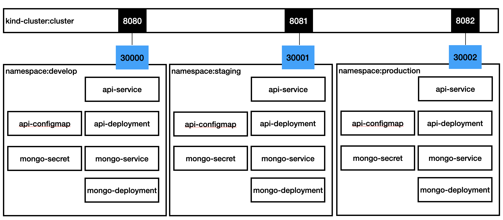

# Nota para o Fabricio
Olá Fabricio! Para responder a ao exercício do módulo 14 criei 3 namespaces para cada um dos ambientes de desenvolvimento (develop, staging e production). Em que cada um tinha a api e uma base de dados para cada, onde cada uma destas base dados tem credenciais differentes.

Nota: O **Kind** nao faz automaticamente o mapping do ports. por isso tive que faze-lo (ver ficheiro [kind.yaml](./k8s/kind.yaml))

Para testar o exercicio pode fazer pela **Alternativa A** (automatizada) ou **Alternativa B** (step by step).

# Alternative A

### 1 - Change sh scripts permissions
> `chmod +x ./k8s/create-cluster.sh && chmod +x ./k8s/setup.sh`
### 2 - Run sh scripts
> `./k8s/create-cluster.sh && ./k8s/setup.sh`

### 3 - Go grab a ☕ and when pods are ready go to links:
- http://localhost:8080/swagger/index.html
- http://localhost:8081/swagger/index.html
- http://localhost:8082/swagger/index.html

# Alternative B
## 1 - Kind Cluster Creation

### Delete kind cluster named cluster if exists
> `kind delete clusters cluster`

### Create a kind cluster to work (if you don't have one) with open ports
> `kind create cluster --config ./k8s/kind.yaml --name cluster`

https://k3d.io/usage/guides/exposing_services/#2-via-nodeport
https://kind.sigs.k8s.io/docs/user/configuration/#extra-port-mappings

## 2 - Setup
### 1 - Create all namespaces (db, develop, staging and production)
> `kubectl apply -f ./k8s/namespaces.yaml`

### 2 - Create Mongo Secret for db namespace (Using terminal) for each environment
> `kubectl create secret generic mongo-secret --from-literal=MONGO_INITDB_ROOT_USERNAME=mongouserdev --from-literal=MONGO_INITDB_ROOT_PASSWORD=mongopwd -n develop`

> `kubectl create secret generic mongo-secret --from-literal=MONGO_INITDB_ROOT_USERNAME=mongouserstag --from-literal=MONGO_INITDB_ROOT_PASSWORD=mongopwd -n staging`

> `kubectl create secret generic mongo-secret --from-literal=MONGO_INITDB_ROOT_USERNAME=mongouserprod --from-literal=MONGO_INITDB_ROOT_PASSWORD=mongopwd -n production`

## 3 - Run mongo deployment and service for each namespace
> `kubectl apply -f ./k8s/mongo/mongo.yaml -n develop`

> `kubectl apply -f ./k8s/mongo/mongo.yaml -n staging`

> `kubectl apply -f ./k8s/mongo/mongo.yaml -n production`

(check in: `kubectl get pods  --all-namespaces`)

## 4 - Create Api ConfigMap for each namespace
> `kubectl apply -f ./k8s/api/config-map/develop.yaml -n develop`

> `kubectl apply -f ./k8s/api/config-map/staging.yaml -n staging`

> `kubectl apply -f ./k8s/api/config-map/production.yaml -n production`

## Create api pod & Create api Service for each namespace
> `kubectl apply -f ./k8s/api/deployment/api.yaml -n develop`

> `kubectl apply -f ./k8s/api/deployment/api.yaml -n staging`

> `kubectl apply -f ./k8s/api/deployment/api.yaml -n production`

## Create api pod & Create api services for each namespace
> `kubectl apply -f ./k8s/api/services/api-develop-service.yaml`

> `kubectl apply -f ./k8s/api/services/api-staging-service.yaml`

> `kubectl apply -f ./k8s/api/services/api-production-service.yaml`

(check in: `kubectl get pods  --all-namespaces`)

After all running go to:
- http://localhost:8080/swagger (Develop)
- http://localhost:8081/swagger (Staging)
- http://localhost:8082/swagger (Production)

## Commands
kubectl get pods
kubectl get endpoints
kubectl get all
kubectl delete -f <filePath/folderPath>

kubectl get deployments --all-namespaces -o wide
